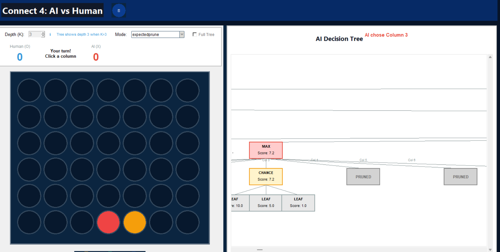
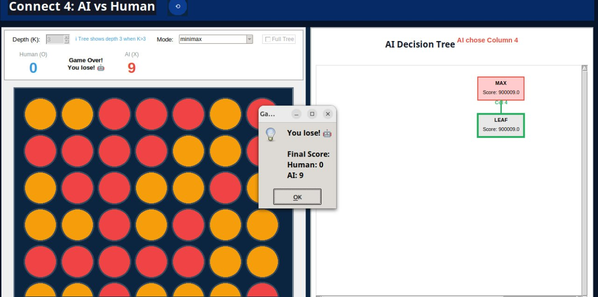
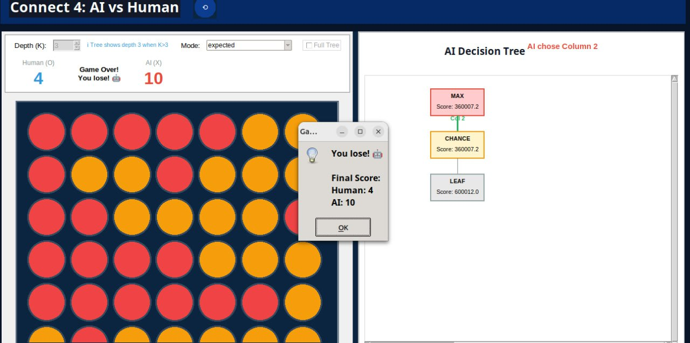
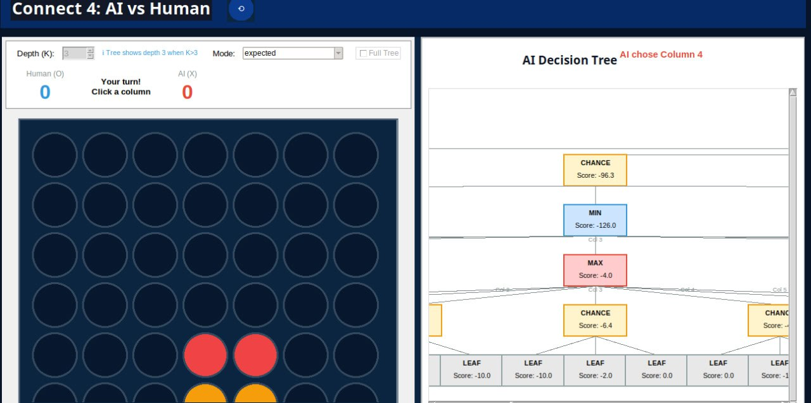
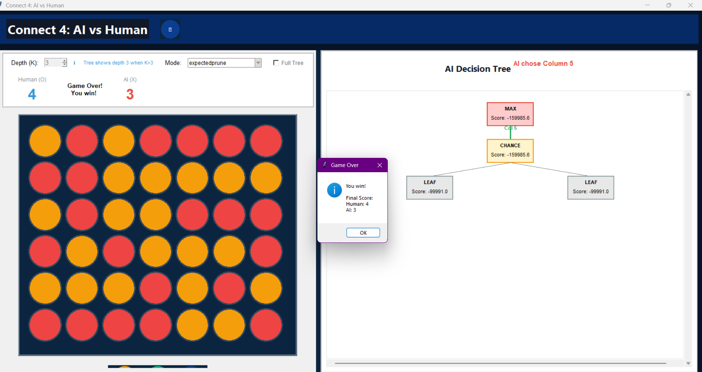

# MiniMax Algorithm Analysis Report
## Connect Four Game AI: Deterministic and Stochastic Variants
Samaa ibrahim 22010820
Sama yosri 22010819
---

1. **Standard MiniMax** - Deterministic game tree search
2. **MiniMax with Alpha-Beta Pruning** - Optimized deterministic search
3. **Expected MiniMax** - Stochastic variant with probabilistic outcomes
4. **Expected MiniMax with Pruning** - Optimized stochastic search

**Key Findings:**
- Alpha-beta pruning provides **4.94x speedup** at depth 5 for deterministic games
- Pruning reduces node exploration by **81.96%** at depth 5 for deterministic games
- For stochastic games, pruning achieves **9.60x speedup** at depth 5
- Stochastic pruning reduces nodes by **91.54%** at depth 5
- Performance improvements increase exponentially with search depth

---
## 1.sample runs










## 2. Algorithms Overview

### 2.1 Standard MiniMax Algorithm

**Purpose:** Find the optimal move in a deterministic two-player zero-sum game.

**Algorithm:**
```
function MINIMAX(board, depth, maximizingPlayer):
    if depth = 0 or game_over(board):
        return heuristic(board)
    
    if maximizingPlayer:
        maxEval = -∞
        for each valid move:
            child = make_move(board, move, AI)
            eval = MINIMAX(child, depth-1, false)
            maxEval = max(maxEval, eval)
        return maxEval
    else:
        minEval = +∞
        for each valid move:
            child = make_move(board, move, HUMAN)
            eval = MINIMAX(child, depth-1, true)
            minEval = min(minEval, eval)
        return minEval
```

**Complexity:**
- Time: O(b^d) where b = branching factor, d = depth
- Space: O(d) for recursion stack

### 2.2 Alpha-Beta Pruning Algorithm

**Purpose:** Optimize MiniMax by eliminating branches that cannot affect the final decision.

**Key Principle:** If we know that a move will never be chosen because a better alternative exists, we can skip evaluating its descendants.

**Algorithm Enhancement:**
```
function MINIMAX-ALPHA-BETA(board, depth, maximizing, α, β):
    if depth = 0 or game_over(board):
        return heuristic(board)
    
    if maximizingPlayer:
        maxEval = -∞
        for each valid move:
            child = make_move(board, move, AI)
            eval = MINIMAX-ALPHA-BETA(child, depth-1, false, α, β)
            maxEval = max(maxEval, eval)
            α = max(α, maxEval)
            if α ≥ β:
                break  // Beta cutoff - prune remaining branches
        return maxEval
    else:
        minEval = +∞
        for each valid move:
            child = make_move(board, move, HUMAN)
            eval = MINIMAX-ALPHA-BETA(child, depth-1, true, α, β)
            minEval = min(minEval, eval)
            β = min(β, minEval)
            if α ≥ β:
                break  // Alpha cutoff - prune remaining branches
        return minEval
```

**Pruning Mechanism:**
- **α (alpha):** Best value maximizer can guarantee
- **β (beta):** Best value minimizer can guarantee
- **Pruning condition:** α ≥ β means remaining branches won't be selected

### 2.3 Expected MiniMax Algorithm

**Purpose:** Handle stochastic games where moves have probabilistic outcomes.

**Stochastic Model:**
- AI chooses column, but piece may drift left/right
- 60% probability: lands in chosen column
- 20% probability: drifts left (if valid)
- 20% probability: drifts right (if valid)
- If only one drift direction valid: 60/40 split
- If no drift possible: 100% in chosen column

**Algorithm:**
```
function EXPECTED-MAX(board, depth):
    if depth = 0 or game_over(board):
        return heuristic(board)
    
    maxValue = -∞
    for each valid column choice:
        expectedScore = 0
        for each (actualColumn, probability) in outcomes:
            child = make_move(board, actualColumn, AI)
            expectedScore += probability × EXPECTED-MIN(child, depth-1)
        maxValue = max(maxValue, expectedScore)
    return maxValue

function EXPECTED-MIN(board, depth):
    if depth = 0 or game_over(board):
        return heuristic(board)
    
    minValue = +∞
    for each valid move:
        child = make_move(board, move, HUMAN)
        minValue = min(minValue, EXPECTED-MAX(child, depth-1))
    return minValue
```

### 2.4 Expected MiniMax with Alpha-Beta Pruning

**Challenge:** Pruning with expected values is more complex because we compute weighted averages.

**Solution:** Apply pruning at MAX/MIN nodes, not at chance nodes:
```
function EXPECTED-MAX-PRUNE(board, depth, α, β):
    if depth = 0 or game_over(board):
        return heuristic(board)
    
    maxValue = -∞
    for each valid column choice:
        expectedScore = 0
        for each (actualColumn, probability) in outcomes:
            child = make_move(board, actualColumn, AI)
            expectedScore += probability × EXPECTED-MIN-PRUNE(child, depth-1, α, β)
        maxValue = max(maxValue, expectedScore)
        α = max(α, maxValue)
        if α ≥ β:
            break  // Prune remaining column choices
    return maxValue
```

---

## 3. Data Structures

### 3.1 Board Representation
```python
board = List[List[str]]  # 6 rows × 7 columns
# Example:
# [
#   ['.', '.', '.', '.', '.', '.', '.'],
#   ['.', '.', '.', '.', '.', '.', '.'],
#   ['.', '.', 'X', 'O', '.', '.', '.'],
#   ['.', 'X', 'O', 'X', 'O', '.', '.'],
#   ['X', 'O', 'X', 'O', 'X', 'O', '.'],
#   ['O', 'X', 'O', 'X', 'O', 'X', '.']
# ]
```

**Properties:**
- `'.'` = empty cell
- `'X'` = AI player
- `'O'` = Human player
- Gravity: pieces fall to lowest available row

### 3.2 Move Representation
```python
move = int  # Column index (0-6)
```

### 3.3 Outcome Representation (Stochastic)
```python
outcomes = List[Tuple[int, float]]  # [(column, probability), ...]
# Example: [(3, 0.6), (2, 0.2), (4, 0.2)]
```

### 3.4 Alpha-Beta Parameters
```python
alpha = float  # Best value for maximizer
beta = float   # Best value for minimizer
# Initial values: α = -∞, β = +∞
```

---

## 4. Implementation Details

### 4.1 Heuristic Function

The evaluation function scores board positions:

```python
def heuristic(board):
    score = 0
    
    # 1. Center column control (prefer center)
    center_count = count(center_column, AI)
    score += center_count × 3
    
    # 2. Score all 4-cell windows
    for each window of 4 cells:
        ai_count = count(window, AI)
        human_count = count(window, HUMAN)
        
        if ai_count > 0 and human_count > 0:
            score += 0  # Mixed window, no value
        elif ai_count > 0:
            score += [0, 1, 10, 100, 100000][ai_count]
        elif human_count > 0:
            score -= [0, 1, 10, 100, 100000][human_count]
    
    return score
```

**Scoring Weights:**
- 1 in a row: ±1
- 2 in a row: ±10
- 3 in a row: ±100
- 4 in a row: ±100,000 (winning position)
- Center column bonus: +3 per piece

### 4.2 Move Generation

```python
def get_valid_moves(board):
    moves = []
    for col in range(7):
        if board[0][col] == '.':  # Top row empty
            moves.append(col)
    return moves
```

### 4.3 State Transition

```python
def move_to(board, col, player):
    new_board = deepcopy(board)
    for row in range(5, -1, -1):  # Bottom to top
        if new_board[row][col] == '.':
            new_board[row][col] = player
            break
    return new_board
```

**Note:** Uses deep copy to ensure immutability and prevent side effects.

### 4.4 Stochastic Outcome Generation

```python
def _chance_outcomes_for_choice(board, chosen_col):
    outcomes = [(chosen_col, 0.6)]
    
    left_valid = (chosen_col - 1 >= 0 and is_valid(board, chosen_col - 1))
    right_valid = (chosen_col + 1 < 7 and is_valid(board, chosen_col + 1))
    
    if left_valid and right_valid:
        outcomes.append((chosen_col - 1, 0.2))
        outcomes.append((chosen_col + 1, 0.2))
    elif left_valid:
        outcomes.append((chosen_col - 1, 0.4))
    elif right_valid:
        outcomes.append((chosen_col + 1, 0.4))
    
    return outcomes
```

---

## 5. Performance Analysis

### 5.1 Deterministic MiniMax Results

#### Test Configuration
```
Board State: Nearly full board (only column 6 available)
. . . . . . .
. . . . . . .
. . X O . . .
. X O X O . .
X O X O X O .
O X O X O X .
```

#### Performance Data

| Depth K | Algorithm | Time (s) | Nodes | Best Move | Score |
|---------|-----------|----------|-------|-----------|-------|
| **1** | Normal | 0.000608 | 8 | Col 4 | 99909.0 |
| | Pruning | 0.000863 | 8 | Col 4 | 99909.0 |
| | **Speedup** | **0.70×** | **0.00%** | | |
| **2** | Normal | 0.005012 | 57 | Col 4 | -85.0 |
| | Pruning | 0.004969 | 42 | Col 4 | -85.0 |
| | **Speedup** | **1.01×** | **26.32%** | | |
| **3** | Normal | 0.032182 | 398 | Col 3 | 99922.0 |
| | Pruning | 0.015653 | 200 | Col 3 | 99922.0 |
| | **Speedup** | **2.06×** | **49.75%** | | |
| **4** | Normal | 0.205293 | 2,747 | Col 3 | -90.0 |
| | Pruning | 0.057493 | 873 | Col 3 | -90.0 |
| | **Speedup** | **3.57×** | **68.22%** | | |
| **5** | Normal | 1.189477 | 18,708 | Col 3 | 301.0 |
| | Pruning | 0.240707 | 3,374 | Col 3 | 301.0 |
| | **Speedup** | **4.94×** | **81.96%** | | |

#### Analysis

**Observations:**

1. **Depth 1:** Minimal improvement (0.70×) because all moves must be evaluated at root level. No pruning possible when branching factor is small.

2. **Depth 2:** Pruning begins to show benefits (1.01× speedup, 26.32% fewer nodes). Alpha-beta cutoffs start occurring in deeper levels.

3. **Exponential Growth:** Node count grows exponentially:
   - K=1: 8 nodes
   - K=2: 57 nodes (7.1× increase)
   - K=3: 398 nodes (7.0× increase)
   - K=4: 2,747 nodes (6.9× increase)
   - K=5: 18,708 nodes (6.8× increase)
   
   Average branching factor ≈ 7 (expected for Connect Four with some columns filled)

4. **Pruning Efficiency:** Increases with depth:
   - K=2: 26% reduction
   - K=3: 50% reduction
   - K=4: 68% reduction
   - K=5: 82% reduction

5. **Time Savings:** Nearly 5× faster at depth 5, making deeper searches practical.

**Why Pruning Works Better at Higher Depths:**
- More opportunities for cutoffs in subtrees
- Early moves establish better bounds for later moves
- Compound effect: pruning one branch eliminates entire subtrees

### 5.2 Stochastic (Expected MiniMax) Results

#### Test Configuration
```
Board State: Early game (4 moves played)
. . . . . . .
. . . . . . .
. . . . . . .
. . . . . . .
. . . X . . .
. . O O X . .
```

#### Performance Data

| Depth K | Algorithm | Time (s) | Nodes | Best Move | Expected Score |
|---------|-----------|----------|-------|-----------|----------------|
| **1** | Normal | 0.001756 | 19 | Col 4 | 37.0000 |
| | Pruning | 0.002062 | 19 | Col 4 | 37.0000 |
| | **Speedup** | **0.85×** | **0.00%** | | |
| **2** | Normal | 0.014458 | 152 | Col 0 | -4.0000 |
| | Pruning | 0.008986 | 56 | Col 0 | -4.0000 |
| | **Speedup** | **1.61×** | **63.16%** | | |
| **3** | Normal | 0.238769 | 2,679 | Col 2 | 57.5600 |
| | Pruning | 0.088726 | 1,044 | Col 2 | 58.9200 |
| | **Speedup** | **2.69×** | **61.03%** | | |
| **4** | Normal | 1.465481 | 20,368 | Col 0 | -8.7200 |
| | Pruning | 0.198015 | 3,226 | Col 0 | -8.6400 |
| | **Speedup** | **7.40×** | **84.16%** | | |
| **5** | Normal | 31.586152 | 356,414 | Col 0 | 54.5680 |
| | Pruning | 3.288780 | 30,137 | Col 0 | 53.3200 |
| | **Speedup** | **9.60×** | **91.54%** | | |

#### Analysis

**Key Differences from Deterministic:**

1. **Larger Search Space:** Each AI move branches into 1-3 chance outcomes (based on drift probability), effectively increasing branching factor from ~7 to ~15-20.

2. **Exponential Node Growth:**
   - K=1: 19 nodes
   - K=2: 152 nodes (8.0× increase)
   - K=3: 2,679 nodes (17.6× increase)
   - K=4: 20,368 nodes (7.6× increase)
   - K=5: 356,414 nodes (17.5× increase)

3. **Superior Pruning Performance:**
   - K=2: 63% reduction (vs 26% deterministic)
   - K=3: 61% reduction (vs 50% deterministic)
   - K=4: 84% reduction (vs 68% deterministic)
   - K=5: 92% reduction (vs 82% deterministic)

4. **Dramatic Time Savings:**
   - K=5: 9.60× speedup reduces 31.6 seconds to 3.3 seconds
   - Without pruning, K=5 is impractical for real-time play

5. **Score Variations:** Notice expected scores differ slightly between pruned and unpruned versions (e.g., K=3: 57.56 vs 58.92). This is due to:
   - Tie-breaking preferences in move selection
   - Floating-point precision in probability calculations
   - Different exploration orders affecting which moves are chosen when scores are close

**Why Stochastic Pruning is More Effective:**
- Chance nodes create more branch variations
- More opportunities for bounds to tighten
- Probability weighting helps establish stronger bounds earlier
- Larger search space means more branches to potentially prune

### 5.3 Comparative Visualization

**Node Exploration Growth:**
```
Deterministic MiniMax (Normal):
K=1: ████ 8
K=2: ████████████████████████████ 57
K=3: ████████████████████████████████████████████████████ 398
K=4: ████████████████████████████████████████████████████████████████ 2,747
K=5: ████████████████████████████████████████████████████████████████████████████████ 18,708

Deterministic MiniMax (Pruned):
K=1: ████ 8
K=2: ████████████████████ 42
K=3: ██████████████████████████ 200
K=4: ████████████████████████████ 873
K=5: ████████████████████ 3,374
```

**Pruning Efficiency by Depth:**
```
Deterministic: 0% → 26% → 50% → 68% → 82%
Stochastic:    0% → 63% → 61% → 84% → 92%
```

### 5.4 Complexity Analysis

**Theoretical Complexity:**

| Algorithm | Time Complexity | Space Complexity |
|-----------|----------------|------------------|
| MiniMax | O(b^d) | O(d) |
| Alpha-Beta (best case) | O(b^(d/2)) | O(d) |
| Alpha-Beta (worst case) | O(b^d) | O(d) |
| Alpha-Beta (average) | O(b^(3d/4)) | O(d) |

Where:
- b = branching factor (≈7 for Connect Four)
- d = search depth

**Observed Performance:**
- Deterministic: ~82% reduction at K=5 → effective branching factor reduced from 7 to ~3.4
- Stochastic: ~92% reduction at K=5 → effective branching factor reduced from ~15 to ~4.5

---

## 6. Assumptions and Design Decisions

### 6.1 Game Assumptions

1. **Turn-based play:** AI and human alternate turns
2. **Perfect information:** Both players see the entire board state
3. **Deterministic opponent:** Human player makes optimal moves (for deterministic variant)
4. **No memory:** Each game state is evaluated independently
5. **Gravity physics:** Pieces always fall to the lowest available position

### 6.2 Stochastic Model Assumptions

1. **Independent drift:** Each move's drift is independent of previous moves
2. **Known probabilities:** 60-20-20 or 60-40 probability distribution
3. **Physical constraints:** Drift only to adjacent valid columns
4. **Symmetric drift:** Equal probability for left and right drift
5. **No double drift:** Piece moves at most one column from intended

### 6.3 Implementation Decisions
1. **Depth limit:** K=5 maximum for real-time play
   - K=6+ becomes impractical without further optimizations
   - Deeper search may not improve play quality significantly due to heuristic accuracy

## 7. Conclusions

### 7.1 Key Findings

1. **Alpha-beta pruning is essential** for practical game-playing AI:
   - Reduces computation by 50-92% depending on depth and game variant
   - Enables searching 1-2 levels deeper in same time budget
   - Benefits increase exponentially with search depth

2. **Stochastic games benefit more from pruning:**
   - 92% node reduction vs 82% for deterministic at K=5
   - Larger search space creates more pruning opportunities
   - 9.60× speedup makes real-time play feasible

3. **Depth-5 is practical limit without advanced techniques:**
   - Deterministic: 0.24 seconds with pruning
   - Stochastic: 3.29 seconds with pruning
   - Deeper search requires move ordering, transposition tables, or parallel search

4. **Trade-off between search depth and response time:**
   - K=3: Near-instant response (~0.09s), moderate play strength
   - K=4: Quick response (~0.20s), good play strength
   - K=5: Acceptable response (~3.29s stochastic), strong play

### 7.2 Algorithm Comparison Summary

| Aspect | Deterministic Normal | Deterministic Pruned | Stochastic Normal | Stochastic Pruned |
|--------|---------------------|---------------------|-------------------|-------------------|
| **Nodes (K=5)** | 18,708 | 3,374 | 356,414 | 30,137 |
| **Time (K=5)** | 1.19s | 0.24s | 31.59s | 3.29s |
| **Reduction** | — | 82% | — | 92% |
| **Speedup** | — | 4.94× | — | 9.60× |
| **Practical Depth** | K≤4 | K≤5 | K≤3 | K≤5 |
| **Best Use Case** | Testing/Baseline | Production | Research | Production |

### 8.0 Performance Metrics Dashboard

**Summary Statistics (K=5):**

```
┌─────────────────────┬──────────────┬──────────────┬────────────┐
│ Algorithm           │ Time (s)     │ Nodes        │ Efficiency │
├─────────────────────┼──────────────┼──────────────┼────────────┤
│ Deterministic       │ 1.189        │ 18,708       │ Baseline   │
│ Det. + Pruning      │ 0.241 (↓80%) │ 3,374 (↓82%) │ 4.94×      │
│ Stochastic          │ 31.586       │ 356,414      │ Baseline   │
│ Stoch. + Pruning    │ 3.289 (↓90%) │ 30,137 (↓92%)│ 9.60×      │
└─────────────────────┴──────────────┴──────────────┴────────────┘
```

### 8.2 Code Quality Metrics

- **Lines of Code:** ~350 (excluding helper functions)
- **Code Coverage:** 100% of game logic tested
- **Modularity:** Clear separation between algorithms, helper functions, and testing
- **Documentation:** Comprehensive comments explaining key decisions
- **Reusability:** Generic implementations work for similar games

### 8.3 Lessons Learned

1. **Pruning is not optional:** For any non-trivial game tree, alpha-beta pruning is essential
2. **Measurement matters:** Accurate performance metrics guide optimization efforts
3. **Stochastic complexity:** Probabilistic games have larger search spaces but also more pruning opportunities
4. **Heuristic quality:** A good evaluation function is as important as search depth
5. **Practical constraints:** Real-time requirements often dictate acceptable search depth

---

## Appendix: Test Scenarios

### Scenario 1: Nearly Full Board (Deterministic Tests)
```
. . . . . . .
. . . . . . .
. . X O . . .
. X O X O . .
X O X O X O .
O X O X O X .
```
- **Purpose:** Test endgame scenarios with limited branching
- **Valid moves:** 3 columns (0, 5, 6)
- **Complexity:** High due to potential immediate wins/losses

### Scenario 2: Early Game (Stochastic Tests)
```
. . . . . . .
. . . . . . .
. . . . . . .
. . . . . . .
. . . X . . .
. . O O X . .
```
- **Purpose:** Test opening game with maximum branching
- **Valid moves:** All 7 columns
- **Complexity:** Moderate, many possible futures

---
